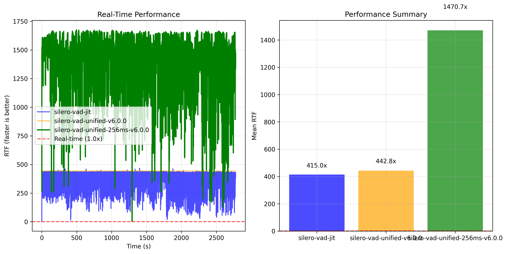
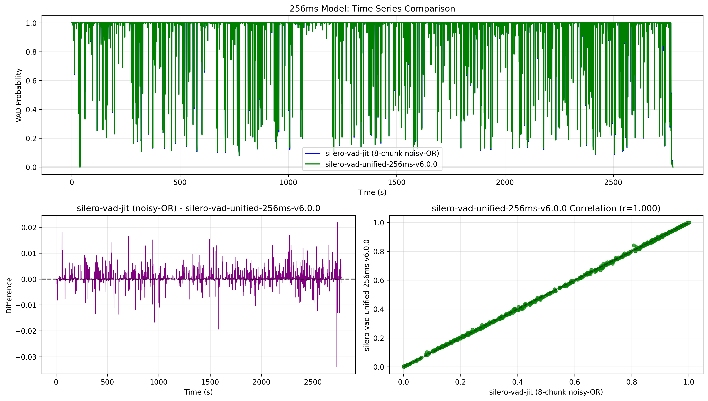

# Benchmarks

2024 MacBook Pro, 48GB Ram, M4 Pro, Tahoe 26.0

## Transcription

https://huggingface.co/FluidInference/parakeet-tdt-0.6b-v3-coreml 

```bash
swift run fluidaudio fleurs-benchmark --languages en_us,it_it,es_419,fr_fr,de_de,ru_ru,uk_ua --samples all
```

```text
Timestamp: 2025-10-24 16:06:18
System: macOS Version 26.1 (Build 25B5072a), arch=arm64, chip=Apple M4 Pro, cores=12/12, mem=48 GB, rosetta=false


Language                  | WER%   | CER%   | RTFx    | Duration | Processed | Skipped
Bulgarian (Bulgaria)      | 12.9   | 4.1    | 190.8   | 3139.5s  | 331       | -
Croatian (Croatia)        | 14.2   | 4.3    | 202.3   | 3161.8s  | 321       | -
Czech (Czechia)           | 12.4   | 3.9    | 214.0   | 3161.1s  | 286       | -
Danish (Denmark)          | 20.3   | 7.5    | 212.2   | 8424.6s  | 804       | -
Dutch (Netherlands)       | 7.7    | 2.6    | 185.0   | 2941.0s  | 327       | -
English (US)              | 5.4    | 2.5    | 203.2   | 3147.7s  | 333       | -
Estonian (Estonia)        | 20.1   | 4.2    | 225.4   | 8529.2s  | 756       | -
Finnish (Finland)         | 15.5   | 3.3    | 221.9   | 8672.8s  | 728       | -
French (France)           | 6.1    | 2.2    | 196.0   | 3204.5s  | 322       | -
German (Germany)          | 7.0    | 2.6    | 210.5   | 3615.8s  | 288       | -
Greek (Greece)            | 36.8   | 13.7   | 179.4   | 5990.8s  | 598       | -
Hungarian (Hungary)       | 17.2   | 5.1    | 214.3   | 8453.7s  | 751       | -
Italian (Italy)           | 5.0    | 1.8    | 237.1   | 3606.4s  | 262       | -
Latvian (Latvia)          | 25.7   | 6.7    | 217.6   | 7933.3s  | 717       | -
Lithuanian (Lithuania)    | 25.4   | 6.9    | 197.8   | 8946.7s  | 885       | -
Maltese (Malta)           | 25.3   | 9.3    | 221.4   | 8815.4s  | 692       | -
Polish (Poland)           | 8.7    | 2.9    | 185.9   | 3057.4s  | 329       | -
Romanian (Romania)        | 14.8   | 4.8    | 197.7   | 8125.9s  | 824       | -
Russian (Russia)          | 7.1    | 2.0    | 205.6   | 3378.4s  | 315       | -
Slovak (Slovakia)         | 12.9   | 4.6    | 227.3   | 3570.4s  | 315       | -
Slovenian (Slovenia)      | 27.0   | 8.9    | 191.9   | 7450.6s  | 792       | -
Spanish (Spain)           | 4.1    | 2.1    | 227.0   | 3351.3s  | 297       | -
Swedish (Sweden)          | 17.0   | 5.0    | 217.9   | 7069.7s  | 681       | -
Ukrainian (Ukraine)       | 7.1    | 2.3    | 202.1   | 3233.2s  | 313       | -
AVERAGE                   | 14.8   | 4.7    | 207.7   | 130981.3 | 12267     | -
Peak memory usage (process-wide): 0.485 GB
```

```text
Timestamp: 10/24/2025, 4:27 PM EDT
System: macOS Version 26.1 (Build 25B5072a), arch=arm64, chip=Apple M4 Pro, cores=12/12, mem=48 GB, rosetta=false

--- Benchmark Results ---
   Dataset: librispeech test-clean
   Files processed: 2474
   Average WER: 2.6%
   Median WER: 0.0%
   Average CER: 1.1%
   Median RTFx: 133.7x
   Overall RTFx: 150.7x (16973.5s / 112.7s)
Peak memory usage (process-wide): 0.379 GB
```

`swift run fluidaudio asr-benchmark --max-files all --model-version v2`

Use v2 if you only need English, it is a bit more accurate

```text
Timestamp: 10/24/2025, 4:31 PM EDT
System: macOS Version 26.1 (Build 25B5072a), arch=arm64, chip=Apple M4 Pro, cores=12/12, mem=48 GB, rosetta=false

--- Benchmark Results ---
   Dataset: librispeech test-clean
   Files processed: 2474
   Average WER: 2.2%
   Median WER: 0.0%
   Average CER: 0.7%
   Median RTFx: 123.8x
   Overall RTFx: 141.2x (16973.5s / 120.2s)
Results saved to: asr_benchmark_results.json
Peak memory usage (process-wide): 0.487 GB
```

### ASR Model Compilation

Core ML first-load compile times captured on iPhone 16 Pro Max and iPhone 13 running the
parakeet-tdt-0.6b-v3-coreml bundle. Cold-start compilation happens the first time each Core ML model
is loaded; subsequent loads hit the cached binaries. Warm compile metrics were collected only on the
iPhone 16 Pro Max run, and only for models that were reloaded during the session.

| Model         | iPhone 16 Pro Max cold (ms) | iPhone 16 Pro Max warm (ms) | iPhone 13 cold (ms) | Compute units               |
| ------------- | --------------------------: | ---------------------------: | ------------------: | --------------------------- |
| Preprocessor  |                        9.15 |                           - |              632.63 | MLComputeUnits(rawValue: 2) |
| Encoder       |                     3361.23 |                      162.05 |             4396.00 | MLComputeUnits(rawValue: 1) |
| Decoder       |                       88.49 |                        8.11 |              146.01 | MLComputeUnits(rawValue: 1) |
| JointDecision |                       48.46 |                        7.97 |               71.85 | MLComputeUnits(rawValue: 1) |

## Text-to-Speech

We generated the same strings with to gerneate audio between 1s to ~300s in order to test the speed across a range of varying inputs on Pytorch CPU, MPS, and MLX pipeline, and compared it against the native Swift version with Core ML models.

Each pipeline warmed up the models by running through it once with pesudo inputs, and then comparing the raw inference time with the model already loaded. You can see that for the Core ML model, we traded lower memory and very slightly faster inference for longer initial warm-up.

Note that the Pytorch kokoro model in Pytorch has a memory leak issue: https://github.com/hexgrad/kokoro/issues/152

The following tests were ran on M4 Pro, 48GB RAM, Macbook Pro. If you have another device, please do try replicating it as well!

### Kokoro-82M PyTorch (CPU)

```bash
KPipeline benchmark for voice af_heart (warm-up took 0.175s) using hexgrad/kokoro
Test   Chars    Output (s)   Inf(s)       RTFx       Peak GB
1      42       2.750        0.187        14.737x    1.44
2      129      8.625        0.530        16.264x    1.85
3      254      15.525       0.923        16.814x    2.65
4      93       6.125        0.349        17.566x    2.66
5      104      7.200        0.410        17.567x    2.70
6      130      9.300        0.504        18.443x    2.72
7      197      12.850       0.726        17.711x    2.83
8      6        1.350        0.098        13.823x    2.83
9      1228     76.200       4.342        17.551x    3.19
10     567      35.200       2.069        17.014x    4.85
11     4615     286.525      17.041       16.814x    4.78
Total  -        461.650      27.177       16.987x    4.85    
```

### Kokoro-82M PyTorch (MPS)

I wasn't able to run the MPS model for longer durations, even with `PYTORCH_ENABLE_MPS_FALLBACK=1` enabled, it kept crashing for the longer strings.

```bash
KPipeline benchmark for voice af_heart (warm-up took 0.568s) using pip package
Test   Chars    Output (s)   Inf(s)       RTFx       Peak GB
1      42       2.750        0.414        6.649x     1.41
2      129      8.625        0.729        11.839x    1.54
Total  -        11.375       1.142        9.960x     1.54    
```

### Kokoro-82M MLX Pipeline

```bash
TTS benchmark for voice af_heart (warm-up took an extra 2.155s) using model prince-canuma/Kokoro-82M
Test   Chars    Output (s)   Inf(s)       RTFx       Peak GB
1      42       2.750        0.347        7.932x     1.12
2      129      8.650        0.597        14.497x    2.47
3      254      15.525       0.825        18.829x    2.65
4      93       6.125        0.306        20.039x    2.65
5      104      7.200        0.343        21.001x    2.65
6      130      9.300        0.560        16.611x    2.65
7      197      12.850       0.596        21.573x    2.65
8      6        1.350        0.364        3.706x     2.65
9      1228     76.200       2.979        25.583x    3.29
10     567      35.200       1.374        25.615x    3.37
11     4615     286.500      11.112       25.783x    3.37
Total  -        461.650      19.401       23.796x    3.37
```

#### Swift + Fluid Audio Core ML models

Note that it does take `~15s` to compile the model on the first run, subsequent runs are shorter, we expect ~2s to load. 

```bash
> swift run fluidaudio tts --benchmark
...
FluidAudio TTS benchmark for voice af_heart (warm-up took an extra 2.348s)
Test   Chars    Ouput (s)    Inf(s)       RTFx
1      42       2.825        0.440        6.424x
2      129      7.725        0.594        13.014x
3      254      13.400       0.776        17.278x
4      93       5.875        0.587        10.005x
5      104      6.675        0.613        10.889x
6      130      8.075        0.621        13.008x
7      197      10.650       0.627        16.983x
8      6        0.825        0.360        2.290x
9      1228     67.625       2.362        28.625x
10     567      33.025       1.341        24.619x
11     4269     247.600      9.087        27.248x
Total  -        404.300      17.408       23.225

Peak memory usage (process-wide): 1.503 GB
```

## Voice Activity Detection

Model is nearly identical to the base model in terms of quality, perforamnce wise we see an up to ~3.5x improvement compared to the silero Pytorch VAD model with the 256ms batch model (8 chunks of 32ms)




Dataset: https://github.com/Lab41/VOiCES-subset

```text
swift run fluidaudio vad-benchmark --dataset voices-subset --all-files --threshold 0.85
...
Timing Statistics:
[18:56:31.208] [INFO] [VAD]    Total processing time: 0.29s
[18:56:31.208] [INFO] [VAD]    Total audio duration: 351.05s
[18:56:31.208] [INFO] [VAD]    RTFx: 1230.6x faster than real-time
[18:56:31.208] [INFO] [VAD]    Audio loading time: 0.00s (0.6%)
[18:56:31.208] [INFO] [VAD]    VAD inference time: 0.28s (98.7%)
[18:56:31.208] [INFO] [VAD]    Average per file: 0.011s
[18:56:31.208] [INFO] [VAD]    Min per file: 0.001s
[18:56:31.208] [INFO] [VAD]    Max per file: 0.020s
[18:56:31.208] [INFO] [VAD]
VAD Benchmark Results:
[18:56:31.208] [INFO] [VAD]    Accuracy: 96.0%
[18:56:31.208] [INFO] [VAD]    Precision: 100.0%
[18:56:31.208] [INFO] [VAD]    Recall: 95.8%
[18:56:31.208] [INFO] [VAD]    F1-Score: 97.9%
[18:56:31.208] [INFO] [VAD]    Total Time: 0.29s
[18:56:31.208] [INFO] [VAD]    RTFx: 1230.6x faster than real-time
[18:56:31.208] [INFO] [VAD]    Files Processed: 25
[18:56:31.208] [INFO] [VAD]    Avg Time per File: 0.011s
```

```text
swift run fluidaudio vad-benchmark --dataset musan-full --num-files all --threshold 0.8
...
[23:02:35.539] [INFO] [VAD] Total processing time: 322.31s
[23:02:35.539] [INFO] [VAD] Timing Statistics:
[23:02:35.539] [INFO] [VAD] RTFx: 1220.7x faster than real-time
[23:02:35.539] [INFO] [VAD] Audio loading time: 1.20s (0.4%)
[23:02:35.539] [INFO] [VAD] VAD inference time: 319.57s (99.1%)
[23:02:35.539] [INFO] [VAD] Average per file: 0.160s
[23:02:35.539] [INFO] [VAD] Total audio duration: 393442.58s
[23:02:35.539] [INFO] [VAD] Min per file: 0.000s
[23:02:35.539] [INFO] [VAD] Max per file: 0.873s
[23:02:35.711] [INFO] [VAD] VAD Benchmark Results:
[23:02:35.711] [INFO] [VAD] Accuracy: 94.2%
[23:02:35.711] [INFO] [VAD] Precision: 92.6%
[23:02:35.711] [INFO] [VAD] Recall: 78.9%
[23:02:35.711] [INFO] [VAD] F1-Score: 85.2%
[23:02:35.711] [INFO] [VAD] Total Time: 322.31s
[23:02:35.711] [INFO] [VAD] RTFx: 1220.7x faster than real-time
[23:02:35.711] [INFO] [VAD] Files Processed: 2016
[23:02:35.711] [INFO] [VAD] Avg Time per File: 0.160s
[23:02:35.744] [INFO] [VAD] Results saved to: vad_benchmark_results.json
```


## Speaker Diarization
