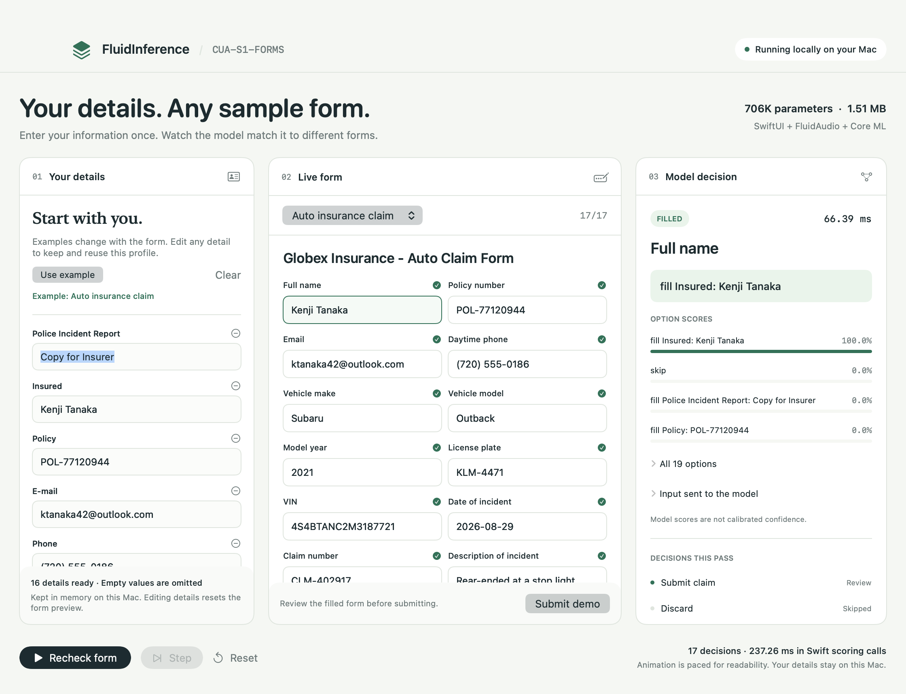

# CUA-S1-FORMS native Mac demo

A standalone SwiftUI app that calls FluidAudio's `CuaS1FormsManager` directly.
Enter your own details once, then watch the real Core ML model match them to
three different forms and explain each decision with live option scores. No Python or browser server
is involved in the running app.



## Run

Requires an Apple silicon Mac with macOS 14+ and Swift 6.0+. Command Line Tools
are enough to build and run the app; XCTest needs a full Xcode installation.

From the FluidAudio repository root:

```bash
Examples/CuaS1FormsDemo/run.sh
```

The script builds and opens `Examples/CuaS1FormsDemo/.build/CUA Forms.app`.
The first launch downloads the 1.51 MB portable model package from the exact
[reviewed HF commit](https://huggingface.co/FluidInference/cua-s1-forms-coreml/tree/c87b915d302bdbff644709408d8fbd8c8effe894),
checks every file's SHA-256, and compiles it locally. Subsequent launches reuse
`~/Library/Application Support/FluidAudio/Demos/CuaS1Forms/`. This works while
the model PR is still open; it does not depend on a model being released on `main`.

To use an existing local package or compiled bundle without downloading:

```bash
Examples/CuaS1FormsDemo/run.sh --model /absolute/path/to/cua_s1_forms_fp16_options32.mlpackage
```

You can also open this example's `Package.swift` in Xcode and run the
`CuaS1FormsDemo` executable scheme, or use:

```bash
swift run --package-path Examples/CuaS1FormsDemo CuaS1FormsDemo
```

## Try it

1. Enter your details in the left panel. It starts empty; **Use example** loads the
   selected form's public sample data for a quick trial. The panel names the sample.
2. Choose **Patient registration**, **Job application**, or **Auto insurance claim**.
   Untouched examples automatically change to match the selected form. Once you edit,
   add, or remove a detail, your profile stays the same across forms, so you can see
   how the model matches different field labels to the same information. Press
   **Use example** again to return to the selected form's sample.
3. Press **Fill form** for a paced pass, or **Step** for one live prediction.
4. Inspect the selected option, candidate probabilities, exact input context, and
   measured time. Click a field or a past decision to inspect it again.
5. Edit a target field and press **Recheck form** after a complete pass. The model
   sees current field values and can choose `skip` for already-filled fields.
6. Press **Submit demo** to produce a local receipt. A model-selected `click`
   remains a proposal; the scoring loop never submits the form itself.

Each example includes data for its form: patient contact, address, insurance, and
emergency contact details; job contact details, LinkedIn, employer, title,
experience, salary, start date, and cover letter; or insurance policy, vehicle,
incident, and claim details. The examples fill 14, 10, and 12 text fields respectively.
Promo, referral, and agent codes are left empty as specified by the original tasks.

Use **Add another detail** for a labeled value such as insurance provider or
current employer. Blank values are excluded from the candidates. An explicit
first and last name also produce a combined full-name choice, unless a full name
is already supplied. The model sees only these current choices plus check/click/skip;
there is no fallback to hidden sample information.

**Stop** cancels a sequence. **Reset** clears the target form and keeps your details.
Editing, adding, or removing source details clears old predictions and resets the
target preview. **Clear** removes personal information from the session. Entered
values stay in memory; the app does not save them or send them over the network.
The 32-option and 96-byte-per-option model limits are validated before inference.

Animation uses a 240 ms presentation delay per control; displayed scoring times
exclude that delay and include the Swift manager call. No audio, external app
control, browser automation, or remote submission is used.

## What this demonstrates

The app contains native SwiftUI controls and changes them using actual model
predictions. Its target form descriptions come from the original Cua demo. Source candidates
come from the editable profile. **Use example** preserves the original document
entities and distractors for reproducible sample checks.
Answer labels are not decoded by the UI catalog or passed to inference; only the
verification command reads them to score correctness.

This is a bounded example of integrating the decision component. It does not
parse a PDF or inspect arbitrary applications. Users enter labeled values themselves; the optional examples supply the original
pre-extracted document entities. These three sample forms do not establish
accuracy on new forms, new languages, or real-world automation tasks.

## Validation

A verification mode uses the same controller and real Swift model manager:

```bash
swift run --package-path Examples/CuaS1FormsDemo CuaS1FormsDemo --verify
```

It checks the explicitly selected initial-form rows **0–17, 68–82, and 130–146**:
50 decisions across the three upstream forms, plus a filled-field recheck,
single-step execution, cancellation/reset, and explicit local submission.
A local run selected all 50 labeled options correctly and passed the state checks.
The check loads an example once, then switches forms to verify that each form gets
its own sample. Unchanged editor updates keep examples following forms; edited
profiles persist, and clearing details prevents samples from returning automatically.
An additional pass enters four public sample values into a blank profile and reuses
that profile across all three forms: supplied names/email/phone are filled, missing
values remain empty, and source edits invalidate the old choices and predictions.
These changed-profile checks are demo regressions, not the original benchmark score.
`--model /absolute/path/to/model.mlpackage` also works in verification mode.

Unit tests cover the pinned fixture, candidate retention, context updates,
fill-value parsing, checkbox/click semantics, invalid-action rejection, empty-profile
handling, source-only candidates, name combination, option/byte limits, example
switching, and preserving edited profiles:

```bash
swift test --package-path Examples/CuaS1FormsDemo
```

The repository CI builds the native demo and runs these tests with Xcode. Locally,
the standalone `--verify` mode can run even when XCTest is unavailable.

For visual regression checks in a logged-in Mac session, the app can save only
its own content view, without screen-recording permission:

```bash
Examples/CuaS1FormsDemo/run.sh \
  --snapshot /absolute/path/to/demo.png --snapshot-filled --exit-after-snapshot
```

Add `--snapshot-form job-application` or `--snapshot-form auto-claim` to check
switching from the patient example to either other form before filling it.

## Source and license

`Sources/CuaDemoCore/Resources/demo.jsonl` is the unmodified MIT-licensed upstream
[demo dataset](https://huggingface.co/datasets/cua-ai/cua-s1-forms/tree/8273f34778b99ac2e12d9f6e7d57dad99ae20845).
Its byte hash is `4f43b442e79ba2e2ce731e27e9b8e340c2b5dfcaffc92d8ff564c34f115ff1ca`.
The bundled source fixture has 196 rows, but the interactive app uses only the
50 original controls before browser chrome and the second UI state. Dataset
revision and hash are validated when the app loads. See [UPSTREAM-LICENSE](UPSTREAM-LICENSE).

The model, model license, and conversion provenance are in
[HF model PR #1](https://huggingface.co/FluidInference/cua-s1-forms-coreml/discussions/1).
Model binaries are downloaded into the local cache and are not committed here.
See [the manager guide](../../Documentation/Decision/CuaS1Forms.md) and
[Mobius PR #97](https://github.com/FluidInference/mobius/pull/97) for the complete
196-row conversion parity checks and reproducible export pipeline.
